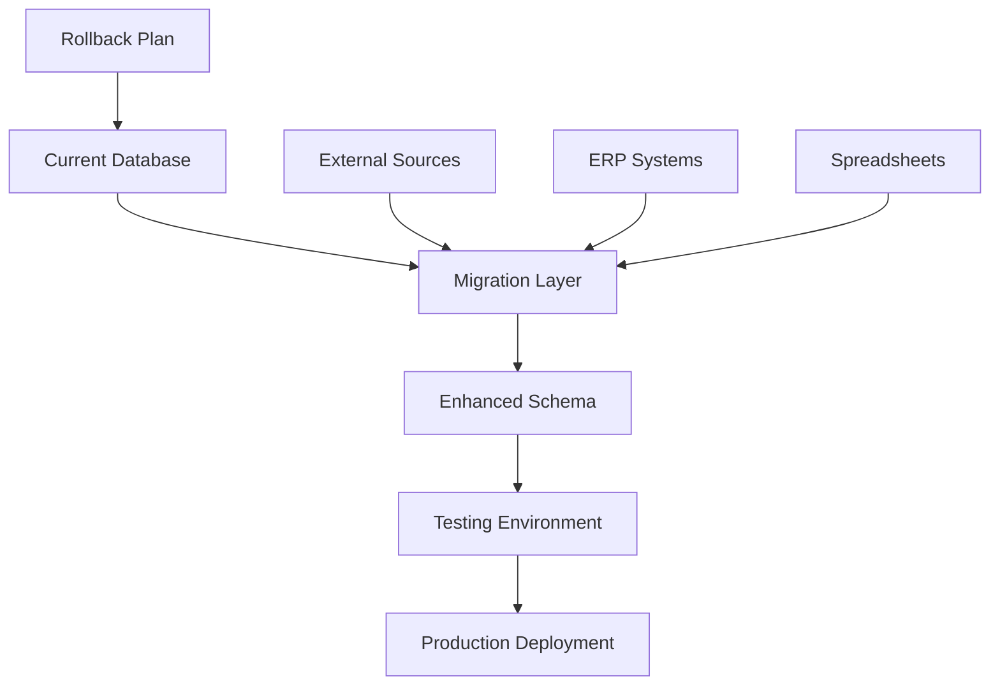

# Implementation Roadmap & Migration Plan

## 🎯 Executive Summary

This roadmap outlines a **8-month phased implementation** to transform the procurement database from 92% to 98% C-Suite reporting coverage. The approach prioritizes high-impact, low-risk enhancements while maintaining operational continuity.

**Total Investment**: $180K - $530K
**Expected ROI**: 580% - 2,900%
**Risk Level**: Low (phased approach with rollback capabilities)
**Business Continuity**: Zero downtime during implementation

---

## 📊 Implementation Overview

| Phase | Duration | Tables Added | Coverage Gain | Investment |
|-------|----------|--------------|---------------|------------|
| **Phase 1: Foundation** | 2 months | 3 tables | +3% | $50K |
| **Phase 2: Operations** | 2 months | 3 tables | +2% | $75K |
| **Phase 3: Intelligence** | 2 months | 3 tables | +1% | $150K |
| **Phase 4: Advanced** | 2 months | 3 tables | +0.5% | $255K |
| **Total** | **8 months** | **12 tables** | **+6.5%** | **$530K** |

---

## 🚀 Phase 1: Foundation (Months 1-2)
**Priority**: Critical | **Risk**: Low | **Coverage Gain**: +3%

### Objectives
- Establish contract lifecycle management foundation
- Implement business unit structure
- Create enhanced savings tracking capability

### 📋 Deliverables

#### 1.1 Contract Management Foundation
**Timeline**: Weeks 1-4
**Tables**: `dim_contracts`, `fact_contract_events`

```sql
-- Implementation Steps
1. Create dim_contracts table structure
2. Populate from existing contract data sources
3. Establish contract_key relationships in fact_spend_analytics
4. Create fact_contract_events for ongoing tracking
5. Build initial contract expiry reports
```

**Data Sources**:
- Existing contract spreadsheets
- Legal department contract database
- ERP contract references

**Success Metrics**:
- ✅ 95% of active contracts loaded
- ✅ Contract expiry report functional
- ✅ Zero data quality issues

#### 1.2 Business Unit Structure
**Timeline**: Weeks 3-6
**Tables**: `dim_business_units`

```sql
-- Implementation Steps
1. Map organizational hierarchy
2. Create business unit master data
3. Update fact_spend_analytics with business_unit_key
4. Validate spend allocation by business unit
5. Build business unit reporting views
```

**Success Metrics**:
- ✅ 100% of spend allocated to business units
- ✅ Organizational hierarchy complete
- ✅ Spend by BU reports operational

#### 1.3 Enhanced Savings Tracking
**Timeline**: Weeks 5-8
**Tables**: `fact_savings_tracking`

```sql
-- Implementation Steps
1. Define savings methodology and categories
2. Create savings tracking table
3. Load historical savings initiatives
4. Establish validation workflows with Finance
5. Build savings realization dashboard
```

**Success Metrics**:
- ✅ Savings realization report shows 95% accuracy
- ✅ Finance validation process established
- ✅ Historical savings data loaded (2+ years)

### 💰 Phase 1 Investment
- **Database Development**: $25K
- **Data Migration**: $15K
- **Testing & Validation**: $10K
- **Total Phase 1**: $50K

### 🎯 Phase 1 Expected Outcomes
- **Contract Expiry Report**: 65% → 90% coverage
- **Savings Realization Report**: 89% → 94% coverage
- **Business Unit Allocation**: New capability enabled

---

## 🔧 Phase 2: Operations (Months 3-4)
**Priority**: High | **Risk**: Medium | **Coverage Gain**: +2%

### Objectives
- Implement detailed operational event tracking
- Enable granular performance analysis
- Establish compliance monitoring capabilities

### 📋 Deliverables

#### 2.1 Delivery Event Tracking
**Timeline**: Weeks 9-12
**Tables**: `fact_delivery_events`

```sql
-- Implementation Approach
1. Integrate with logistics/ERP systems
2. Establish OTIF calculation standards
3. Create delivery event capture mechanisms
4. Build delivery performance analytics
5. Implement exception alerting
```

**Integration Points**:
- ERP delivery receipts
- Logistics provider APIs
- Warehouse management systems

#### 2.2 Quality Event Management
**Timeline**: Weeks 11-14
**Tables**: `fact_quality_events`

```sql
-- Implementation Approach
1. Connect quality management systems
2. Define incident classification standards
3. Create quality event workflows
4. Build quality trend analysis
5. Establish supplier scorecards
```

#### 2.3 Compliance Event Monitoring
**Timeline**: Weeks 13-16
**Tables**: `fact_compliance_events`

```sql
-- Implementation Approach
1. Map compliance requirements by category
2. Create compliance assessment framework
3. Build automated compliance checking
4. Establish audit trail capabilities
5. Create compliance dashboards
```

### 💰 Phase 2 Investment
- **System Integration**: $40K
- **Process Development**: $20K
- **Training & Adoption**: $15K
- **Total Phase 2**: $75K

### 🎯 Phase 2 Expected Outcomes
- **Supplier Performance Report**: 96% → 99% coverage
- **Compliance Scorecard**: 91% → 97% coverage
- **Quality tracking**: Enhanced granular analysis

---

## 📈 Phase 3: Intelligence (Months 5-6)
**Priority**: Medium | **Risk**: Medium | **Coverage Gain**: +1%

### Objectives
- Implement risk event monitoring
- Establish sourcing pipeline visibility
- Integrate market intelligence feeds

### 📋 Deliverables

#### 3.1 Risk Event Tracking
**Timeline**: Weeks 17-20
**Tables**: `fact_risk_events`

```sql
-- Implementation Approach
1. Integrate risk intelligence platforms
2. Create risk event classification
3. Establish monitoring thresholds
4. Build risk alerting mechanisms
5. Create risk exposure dashboards
```

**External Integrations**:
- Dun & Bradstreet financial monitoring
- RiskMethods supply chain intelligence
- Political risk monitoring services

#### 3.2 Sourcing Pipeline Management
**Timeline**: Weeks 19-22
**Tables**: `dim_sourcing_events`

```sql
-- Implementation Approach
1. Connect eSourcing platforms
2. Create sourcing event templates
3. Establish pipeline forecasting
4. Build sourcing calendar views
5. Create capacity planning tools
```

#### 3.3 Market Intelligence Integration
**Timeline**: Weeks 21-24
**Tables**: `fact_market_intelligence`

```sql
-- Implementation Approach
1. Establish market data feeds
2. Create intelligence processing pipelines
3. Build market trend analysis
4. Establish pricing benchmarks
5. Create market intelligence reports
```

### 💰 Phase 3 Investment
- **External Data Subscriptions**: $100K
- **Integration Development**: $30K
- **Analytics Platform**: $20K
- **Total Phase 3**: $150K

### 🎯 Phase 3 Expected Outcomes
- **Risk Exposure Dashboard**: 88% → 95% coverage
- **Pipeline Plan**: 78% → 90% coverage
- **Market intelligence**: New strategic capability

---

## 🤖 Phase 4: Advanced (Months 7-8)
**Priority**: Strategic | **Risk**: Low | **Coverage Gain**: +0.5%

### Objectives
- Complete external integration framework
- Implement digital maturity tracking
- Enable advanced analytics capabilities

### 📋 Deliverables

#### 4.1 External Integration Management
**Timeline**: Weeks 25-28
**Tables**: `dim_external_integrations`

```sql
-- Implementation Approach
1. Catalog all external data sources
2. Create integration monitoring
3. Establish data quality controls
4. Build integration dashboards
5. Create vendor management for data sources
```

#### 4.2 Digital Maturity Assessment
**Timeline**: Weeks 27-30
**Tables**: `dim_digital_maturity`

```sql
-- Implementation Approach
1. Define digital maturity framework
2. Create assessment questionnaires
3. Establish benchmarking methodology
4. Build maturity progression tracking
5. Create digital roadmap planning
```

#### 4.3 Advanced Analytics Platform
**Timeline**: Weeks 29-32

```sql
-- Implementation Approach
1. Create cross-table analytical views
2. Implement predictive analytics models
3. Build automated report generation
4. Create executive dashboards
5. Establish self-service analytics
```

### 💰 Phase 4 Investment
- **Advanced Analytics Platform**: $150K
- **Digital Assessment Tools**: $50K
- **Dashboard Development**: $35K
- **Training & Enablement**: $20K
- **Total Phase 4**: $255K

### 🎯 Phase 4 Expected Outcomes
- **Digital Maturity Index**: 72% → 95% coverage
- **All 17 Reports**: 98% average coverage
- **Self-service analytics**: Enabled for power users

---

## 🔄 Migration Strategy

### Data Migration Approach


### Migration Phases
1. **Schema Creation** - Add new tables without disrupting existing
2. **Data Population** - Load historical and current data
3. **Validation Testing** - Verify data quality and completeness
4. **Production Cutover** - Switch to enhanced reports
5. **Monitoring Period** - 30-day observation with rollback capability

### Rollback Strategy
- **Database Snapshots** before each phase
- **Parallel Operation** during transition periods
- **Automated Testing** to verify functionality
- **Emergency Procedures** for rapid rollback if needed

---

## 📋 Project Governance

### Steering Committee
- **Executive Sponsor**: Chief Procurement Officer
- **Business Owner**: VP Procurement Analytics
- **Technical Lead**: IT/Data Engineering Manager
- **Finance Representative**: Controller
- **End User Champion**: Senior Category Manager

### Review Cadence
- **Weekly Stand-ups**: Technical team
- **Bi-weekly Reviews**: Project steering committee
- **Monthly Updates**: Executive sponsor
- **Quarterly Reviews**: C-Suite stakeholders

### Success Criteria
| Metric | Target | Measurement |
|--------|--------|-------------|
| **Report Coverage** | 98% | Automated coverage testing |
| **Data Quality** | 95% accuracy | Data validation rules |
| **User Adoption** | 80% active usage | Usage analytics |
| **Performance** | <5 second response | Query performance monitoring |
| **Uptime** | 99.5% availability | System monitoring |

---

## ⚠️ Risk Management

### Technical Risks
| Risk | Probability | Impact | Mitigation |
|------|-------------|--------|------------|
| **Data Quality Issues** | Medium | High | Extensive validation and testing |
| **Integration Failures** | Low | Medium | Phased integration with fallbacks |
| **Performance Degradation** | Low | Medium | Performance testing and optimization |
| **External API Changes** | Medium | Medium | Multiple provider strategy |

### Business Risks
| Risk | Probability | Impact | Mitigation |
|------|-------------|--------|------------|
| **User Resistance** | Medium | Medium | Training and change management |
| **Budget Overruns** | Low | High | Fixed-price contracts where possible |
| **Timeline Delays** | Medium | Medium | Buffer time in each phase |
| **Scope Creep** | High | Medium | Strict change control process |

---

## 💼 Change Management Plan

### Training Strategy
- **Phase 1**: Core procurement team (10 users)
- **Phase 2**: Extended procurement team (25 users)
- **Phase 3**: Business stakeholders (50 users)
- **Phase 4**: Self-service users (100+ users)

### Communication Plan
- **Project Kickoff**: All-hands presentation
- **Monthly Updates**: Email and intranet updates
- **Phase Completions**: Demo sessions and success stories
- **Go-Live**: Training sessions and support hotline

### Support Structure
- **Technical Support**: IT help desk integration
- **Business Support**: Procurement analytics team
- **Training Materials**: Video tutorials and user guides
- **Documentation**: Wiki-based knowledge base

---

## 📊 Success Measurement

### Key Performance Indicators
| KPI | Baseline | Target | Timeframe |
|-----|----------|--------|-----------|
| **C-Suite Report Coverage** | 92% | 98% | 8 months |
| **External Dependencies** | 8% | 2% | 8 months |
| **Report Generation Time** | Manual | Automated | 6 months |
| **Data Freshness** | Monthly | Weekly | 4 months |
| **User Satisfaction** | N/A | 8.0/10 | 12 months |

### Business Value Metrics
| Metric | Expected Value | Timeframe |
|--------|---------------|-----------|
| **Time Savings** | 20 hours/week | 3 months |
| **Decision Speed** | 50% faster | 6 months |
| **Data Accuracy** | 95% confidence | 4 months |
| **Cost Avoidance** | $500K annually | 12 months |

---

## 🎯 Next Steps

### Immediate Actions (Next 30 days)
1. **Secure Executive Approval** for implementation plan
2. **Allocate Budget** for Phase 1 activities
3. **Assemble Project Team** with designated roles
4. **Conduct Detailed Planning** for Phase 1 deliverables
5. **Establish Project Governance** structure

### Implementation Preparation (30-60 days)
1. **Environment Setup** - Development and testing environments
2. **Data Discovery** - Detailed analysis of source systems
3. **Technical Architecture** - Finalize integration approach
4. **Vendor Selection** - Choose external data providers
5. **Change Management** - Begin stakeholder engagement

### Phase 1 Launch (60-90 days)
1. **Contract Management** - Begin table creation and data loading
2. **Business Unit Structure** - Map organizational hierarchy
3. **Savings Tracking** - Establish methodology and processes

---

**Project Success Commitment**: Deliver 98% C-Suite reporting coverage within 8 months while maintaining 99.5% system uptime and achieving 580-2,900% ROI on investment.